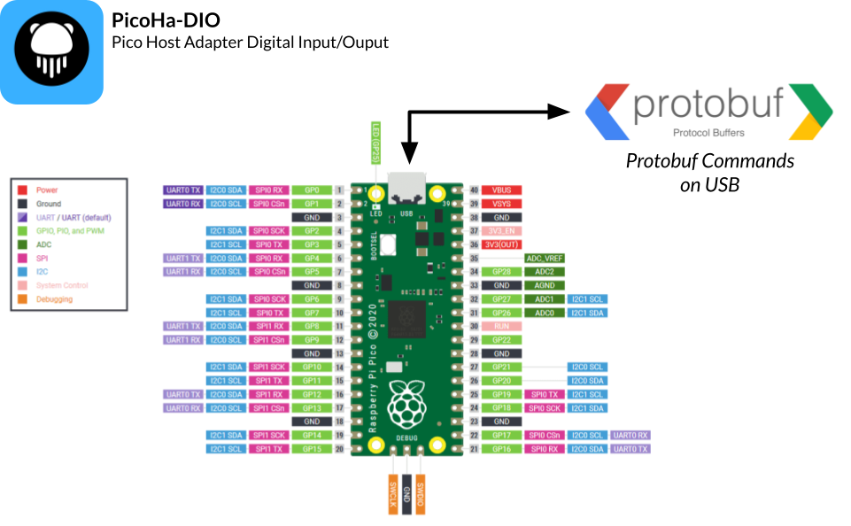

# Pico Host Adapter Dio

This project aims to turn the Raspberry Pi Pico into an USB Host Adapter to control each Digital Input/Output.



## Install firmware on your Pico

[SEE Firmware Documentation](firmware/README.md)

## USB Commands

Commands on USB are based on:

- SLIP [Serial Line Internet Protocol](https://fr.wikipedia.org/wiki/Serial_Line_Internet_Protocol)
- Protobuf [From Google](https://protobuf.dev/)

The USB class used is CDC, it means that you can open it as a serial port.

You must then prepare a Protobuf message with the given specification:

```
firmware\src\api_dio.proto
```

Finally encode the message with SLIP then send it on the serial port.

## Commands examples

For example to set the pin 2 to OUTPUT (by default pins are in INPUT)

```protobuf
message PicohaDioRequest {
    RequestType type = 1;  => SET_PIN_DIRECTION OUTPUT
    uint32 pin_num = 2;    2
    PinValue value = 3;    => OUTPUT
}
```

The board should respond with

```protobuf
message PicohaDioAnswer {
    AnswerType type = 1;                => SUCCESS
    optional PinValue value = 2;
    optional string error_message = 3;
}
```
