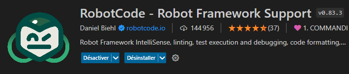
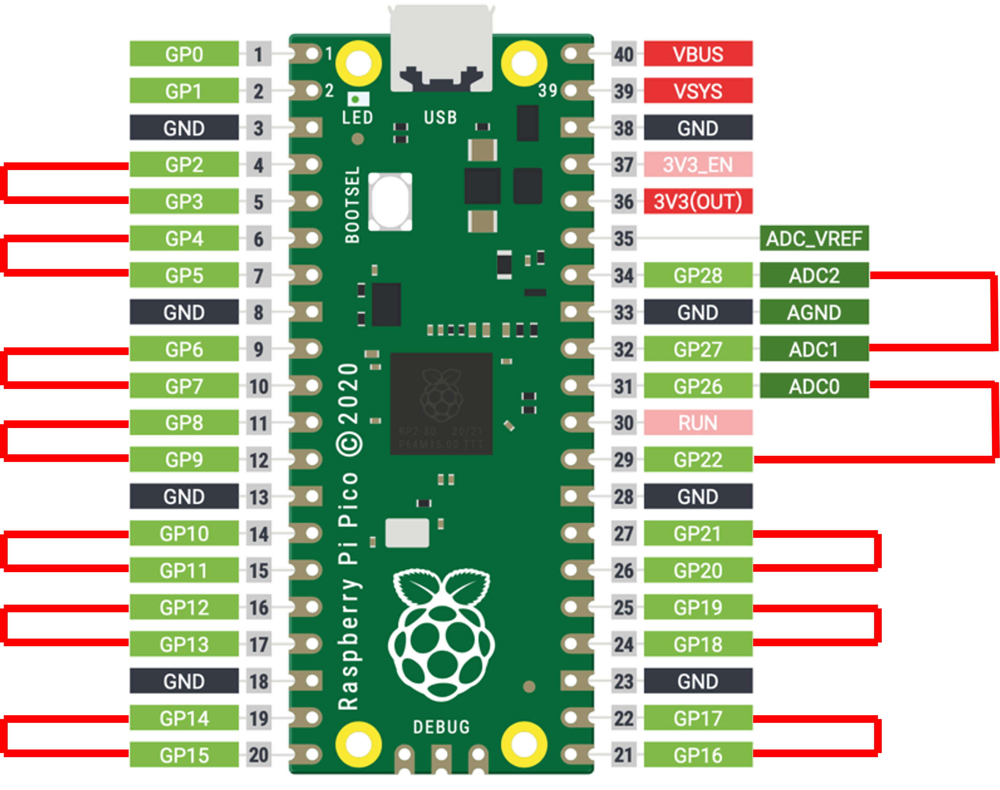

# robot-framework

Panduza Robot is based on tips from robot framework documentation:

- https://docs.robotframework.org/docs/examples/project_structure

<!-- ---------------------------------------------------------------- -->
<!-- ---------------------------------------------------------------- -->
<!-- ---------------------------------------------------------------- -->

## Directory Map

- tests: put your acceptance tests here (.robot)
- platform: contains changing resource configuration of your project
- report-serve.sh: mount a nginx web server for the robot report on this directory (use docker, easy to use on Linux)

<!-- ---------------------------------------------------------------- -->
<!-- ---------------------------------------------------------------- -->
<!-- ---------------------------------------------------------------- -->

## VsCode Extensions

VsCode has become a very important tools in the software industry. You can use it to build your own Robot Test IDE.

### Robot Code

This extension seems better integrated when you work on Windows (less configuration to reach a working point).



<!-- ---------------------------------------------------------------- -->
<!-- ---------------------------------------------------------------- -->
<!-- ---------------------------------------------------------------- -->

## Good Practice

### Use "platform.resource"

This concept allow a better resource management of your test project.

Append all your imports inside a "platform.resource" file, then just import this file in all your tests. (see [platform/RaspberryPico/platform.resource](./platform/RaspberryPico/platform.resource))

Then you just have to import only "platform.resource" (see [tests/Test_Suite_GPIO.robot](./tests/Test_Suite_GPIO.robot))

Moreover, you can create one platform directory for each of your tests configuration. This way you will be able to switch from one to an other than to pythonpath.

Here you are using the "template" resources

```json
"robotcode.robot.pythonPath": [
    "${workspaceFolder}/platform/template"
]
```

Here you are using the "demo" resources

```json
"robotcode.robot.pythonPath": [
    "${workspaceFolder}/platform/demo"
]
```

### Gherkin on high level test description (Given, When, Then)

Robot Framework is a great python test framework but Gherkin provide a better test description syntax.

I advice to use it on your high level test descriptions : (see [tests/Test_Suite_GPIO.robot](./tests/Test_Suite_GPIO.robot))

By the way, if your are not using python on some other project... Go see https://cucumber.io/


## SETUP

### Prerequisites

In order to use this systeme you shall install few module python : [PROTOBUF](https://protobuf.dev/) and [SLIP](https://sliplib.readthedocs.io/en/develop/module.html#module-sliplib.slip).
You can install their using : 

```python install -r requierement.txt```.

You shall use the same PROTOBUF version as [api_dio_pb2.py](./libraries/api_dio_pb2.py) file. Thie file was previously genereted from [api_dio.proto](../../firmware/src/api_dio.proto).

Here ```Protobuf Python Version: 5.28.0```

### Bench

You will need an Raspberry Pico with Panduza Firmware flashed.

To simplified testing we connecte GPIOs by pair, link so:



 - GPIO 0 and 1 a reserved for debbug
 - GPIO 2 with GPIO 3, 4 with 5 and so one
 - there is one exeption: GPIO 25 is buildin LED 

## Run campaine test

Use a ['Robot Framework Test Suite'](./tests/) to run a test campaine with robot. If you used [requierement.txt](requirements.txt), Robot is already insalled.

Exemple :
```
cd ./tests
robot Test_Suite_GPIO.robot
```

Note: Check communication port number on your device management and put it on [platform.resource](./platform/RaspberryPico/platform.resource)
