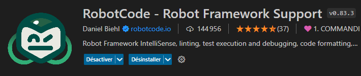
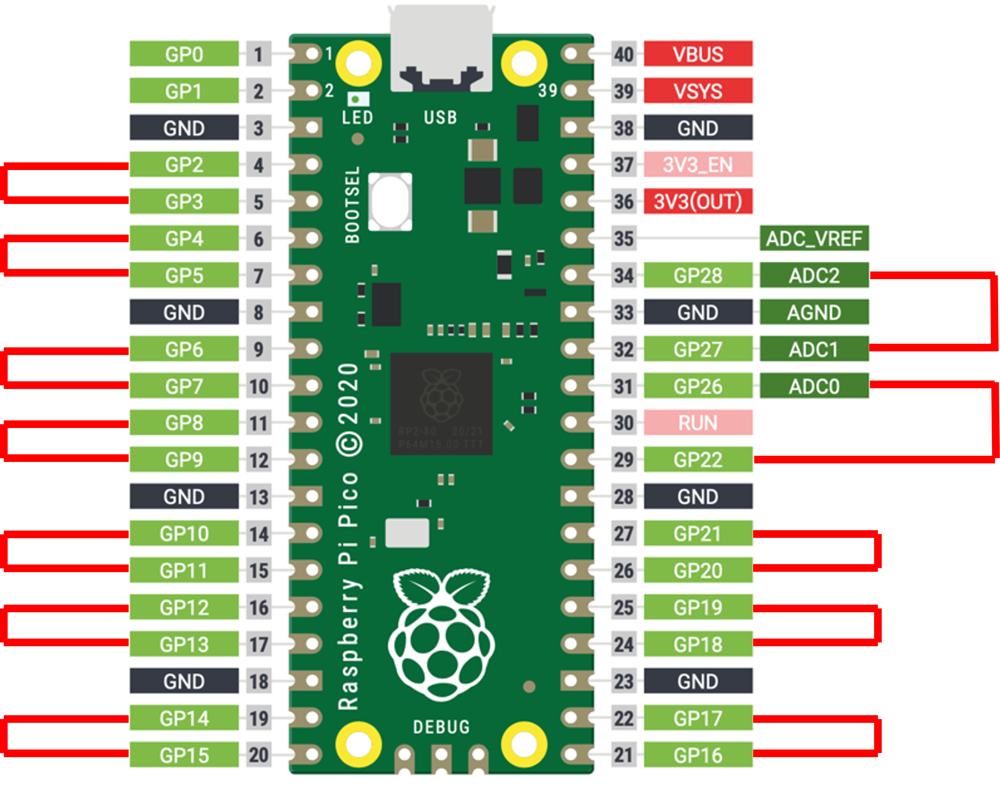

# robot-framework

Panduza Robot is based on tips from robot framework documentation:

- https://docs.robotframework.org/docs/examples/project_structure

<!-- ---------------------------------------------------------------- -->
<!-- ---------------------------------------------------------------- -->
<!-- ---------------------------------------------------------------- -->

## Directory Map

- tests: put your acceptance tests here (.robot)
- platform: contains changing resource configuration of your project
- report-serve.sh: mount a nginx web server for the robot report on this directory (use docker, easy to use on Linux)

<!-- ---------------------------------------------------------------- -->
<!-- ---------------------------------------------------------------- -->
<!-- ---------------------------------------------------------------- -->

## Visual Studio Code

VsCode has become a very important tools in the software industry. You can use it to build your own Robot Test IDE.

### Extensions

This extension seems better integrated when you work on Windows (less configuration to reach a working point).



Some others, can be find in [extensions](.vscode/extensions.json) file

<!-- ---------------------------------------------------------------- -->


### Settings and "platform.resource"

This concept allow a better resource management of your test project.

Append all your imports inside a "platform.resource" file, then just import this file in all your tests. (see [platform/RaspberryPico/platform.resource](./platform/RaspberryPico/platform.resource))

Then you just have to import only "platform.resource" (see [tests/Test_Suite_GPIO.robot](./tests/Test_Suite_GPIO.robot))

Moreover, you can create one platform directory for each of your tests configuration. This way you will be able to switch from one to an other than to pythonpath.

Here you are using the "template" resources in your [setting](.vscode\settings.json) file.

```json
"robotcode.robot.pythonPath": [
    "${workspaceFolder}/platform/template"
]
```

Here you are using the "demo" resources

```json
"robotcode.robot.pythonPath": [
    "${workspaceFolder}/platform/demo"
]
```


> [!TIP]
> All those VSCode configs can be done in one file with '.code-workspace' extension.
> This last one can be commit and share.
> See documentation in [visualstudio.com](https://code.visualstudio.com/docs/editor/workspaces)


## Gherkin on high level test description (Given, When, Then)

Robot Framework is a great python test framework but Gherkin provide a better test description syntax.

I advice to use it on your high level test descriptions : (see [tests/Test_Suites.robot](./tests/Test_Suites.robot))

By the way, if your are not using python on some other project... Go see https://cucumber.io/


## SETUP

> [!TIP]
>To avoid future conflicts in import modules, we recommend creating a Virtual Environment: Venv.
>To do so in VS Code, follow documentation in [visualstudio.com](https://code.visualstudio.com/docs/python/environments#_creating-environments).

### Prerequisites

In order to use this system you shall install few module python : [PROTOBUF](https://protobuf.dev/) and [SLIP](https://sliplib.readthedocs.io/en/develop/module.html#module-sliplib.slip).
You can install their using [requirement](requirements.txt) file : 

```python install -r requirement.txt```

You shall use the same PROTOBUF version as [api_dio_pb2.py](./libraries/api_dio_pb2.py) file. This file was previously generated from [api_dio.proto](../../firmware/src/api_dio.proto).

Here ```Protobuf Python Version: 5.28.0```

> [!NOTE]  
> If you have to generated api_dio_pb2.py, see documentation: https://protobuf.dev/getting-started/pythontutorial/

### Bench

You will need an Raspberry Pico with Panduza Firmware flashed.

To simplified testing we connect GPIOs by pair, like so:



 - GPIO 0 and 1 a reserved for debug
 - GPIO 2 with GPIO 3, 4 with 5 and so one
 - there is one exception: GPIO 25 is builtin LED 

## Run campagne test

Use a ['Robot Framework Test Suite'](./tests/) to run a test campagne with robot. If you used [requirement.txt](requirements.txt), Robot is already installed.

Example :
```
cd ./tests
robot Test_Suite.robot
```

> [!NOTE]  
> Check communication port number on your device management and put it on [config_file.ini](./platform/RaspberryPico/config_file.ini)

## Docker 

For those who only want use docker, we created an [Dockerfile](./Dockerfile) to build a image using [nginx](https://www.slingacademy.com/article/nginx-execute-shell-commands-on-every-request/).

### Install docker

See the official site to install docker depending of you system : https://docs.docker.com/desktop/


### Build docker image 

This command build docker image according [Dockerfile](./Dockerfile):

```docker build . -t ${IMAGE_NAME}```

### Enter in docker instance
This command allow you to enter in the instance image in bash terminal :

```docker run -it --entrypoint bash ${IMAGE_NAME}```

you can add --device option to connect the pico device to this instance.

Example:
```docker run -it --entrypoint bash --device=/dev/ttyACM0 My_Image```

### Run docker instance
This command start instance. you should be able to connect to nginx server on http://localhost:8080/

```docker run -it --rm -d --name ${container_name} -p 8080:80 ${IMAGE_NAME}```

### Stop docker instance
This command start instance.

```docker stop ${container_name}```

>[!Note]
> I created an executable for linux user: [report-server.sh](./report-server.sh).
> It allow you to run easily docker commend.
